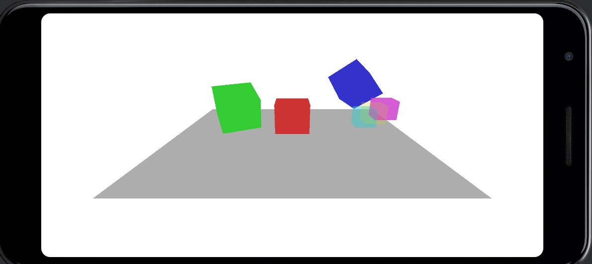

# Android Lab Project 



[한국어](#개요) </br>
[English(Translation)](#overview) </br>

# 개요
`Rust`와 `wgpu`를 사용한 3차원 그래픽스 안드로이드 애플리케이션을 제작한다.

# 빌드
### 1. Android Studio 설치 </br>
이 프로젝트를 빌드하여 애플리케이션을 생성하기 위해서는 Android Studio가 필요합니다. 
다음 [`사이트`](https://developer.android.com/studio/install)를 참고하여 Android Studio를 설치해 주세요. </br>

이 프로젝트는 "NDK"와 "Android SDK Command-line Tools"가 Android Studio에 추가되어야 합니다. </br>

`Settings > Languages & Frameworks > Android SDK > SDK Tools`에서 "NDK (Side by side)"와 "Android SDK Command-line Tools (latest)"를 선택한 후 적용 버튼을 눌러 다운로드 받습니다. </br>

### 2. Rust 설치 </br>
생성된 Android 애플리케이션에 연결되는 라이브러리를 생성하기 위해 Rust가 필요합니다. 
다음 [`사이트`](https://www.rust-lang.org/tools/install)를 참고하여 Rust를 설치해 주세요. </br>

이 프로젝트는 `x86_64` 아키텍처 또는 `arm64` 아키텍처를 사용하는 Android 기기나 애뮬레이터에서 
애플리케이션이 동작하는 것을 전재로 설계되었습니다.</br>

터미널이나 명령 프롬프트에서 다음 명령어를 실행합니다. </br>
```
rustup target add aarch64-linux-android
rustup target add x86_64-linux-android
```

### 3. Python 설치 </br>
Rust 라이브러리를 빌드할 때 Python이 사용됩니다. 
다음 [`사이트`](https://www.python.org/downloads/)를 참고하여 Python을 설치해 주세요. </br>

이 프로젝트는 python을 가리키는 환경 변수 `python3`가 필요합니다. </br>

### 4. Android Studio 실행 및 빌드 </br>
Android Studio를 실행하여 프로젝트의 "Android" 디렉토리를 엽니다. </br>
그 다음 빌드 대상을 선택한 후, 빌드 버튼을 눌러 Android 애플리케이션을 생성하여 실행합니다. </br>

</br>

# Overview
Create a 3D graphics Android application using `Rust` and `wgpu`.

# Build
### 1. Install Android Studio </br>
Android Studio is required to build this project to create an application. 
Please refer to the following [`site`](https://developer.android.com/studio/install) to install Android Studio. </br>

This project requires the "NDK" and "Android SDK Command-line Tools" to be added to Android Studio. </br>
Go to `Settings > Languages & Frameworks > Android SDK > SDK Tools`, select "NDK (Side by side)" and "Android SDK Command-line Tools (latest)" and press the Apply button to download them. </br>

### 2. Install Rust </br>
Rust is required to create the libraries that link to the generated Android application. 
Please refer to the following [`site`](https://www.rust-lang.org/tools/install) to install Rust. </br>

This project is designed entirely for applications to work on Android devices or emulators using the `x86_64` architecture or `arm64` architecture. </br>

In a terminal or cmd, run the following commands </br>
```
rustup target add aarch64-linux-android
rustup target add x86_64-linux-android
```

### 3. Install Python </br>
Python is used to build the Rust library. 
Please refer to the following [`site`](https://www.python.org/downloads/) to install Python. </br>

This project requires the environment variable `python3`, which points to python. </br>

### 4. Launch Android Studio and build application
Run Android Studio to open the "Android" directory for this project. </br>
Next, select a build target, and then press the Build button to generate and run Android application. </br>
